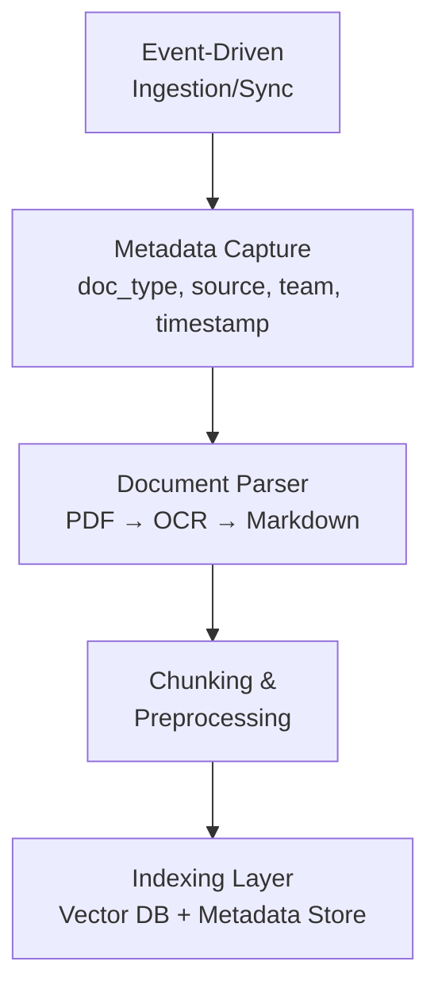

# United RAG Agent: Document Unification & Retrieval System

## Overview

This project solves the problem of fragmented documentation across teams and storage platforms (e.g., Google Drive, Google Cloud, Outlook).
The system ingests documents from different sources, normalizes their structure, and indexes them for semantic search and question answering (Q&A).

The goal:

Ask a question once, get a consistent answer — regardless of where the source document lives or what format it was in.

## High-Level Architecture



## Components

### 1. Ingestion / Sync Layer
- Triggered when documents are added/updated.
- Prototype: manual runs or scheduled polling.
- Future: webhooks (e.g., Google Drive push notifications).

Responsibilities:
- Fetch document from source.
- Extract basic metadata.
- Send document into the pipeline.

---

### 2. Metadata Schema

Every document will store basic metadata alongside the content.
This allows filtering and governance later.

```json
{
  "doc_id": "uuid-1234",
  "doc_name": "Q3_Budget_Report.pdf",
  "doc_type": "pdf",
  "source": "GoogleDrive",
  "team": "Finance",
  "ingested_at": "2025-09-29T18:30:00Z"
}
```

---

### 3. Document Parsing (MVP: PDFs only)
- Use Mistral OCR to extract text from scanned PDFs.
- Convert raw text → Markdown (preserves structure like headings, lists, tables).

Future expansion:
- WordDocument, ExcelDocument, PPTDocument classes.
- Each parser will implement a common Document interface.

---

### 4. Chunking & Preprocessing

Once in Markdown, documents are split into meaningful chunks.

Chunking strategy:
- Split by sections/headings (#, ##, ###).
- Preserve section title in metadata.
- Ensure each chunk stays under X tokens (for LLM retrieval).

Chunk schema:

```json
{
  "chunk_id": "uuid-5678",
  "doc_id": "uuid-1234",
  "section_title": "Marketing Spend",
  "content": "In Q3, marketing spend increased by 12%...",
  "tokens": 178
}
```

---

### 5. Indexing Strategy
- Vector DB (e.g., Pinecone, Weaviate, Qdrant) stores embeddings of chunks.
- Metadata (doc_type, team, source, etc.) stored alongside for filtering.
- Retrieval (MVP): semantic search only.
- Future: hybrid search (semantic + BM25 keyword).

## Repository Structure

```
/src
  /ingestion       # source connectors (GoogleDriveSource, etc.)
  /parsers         # document parsers (PDFParser, WordParser, etc.)
  /normalization   # metadata + schema handlers
  /chunking        # splitting docs into chunks
  /indexing        # vector DB + metadata storage
/tests             # unit tests
README.md
```